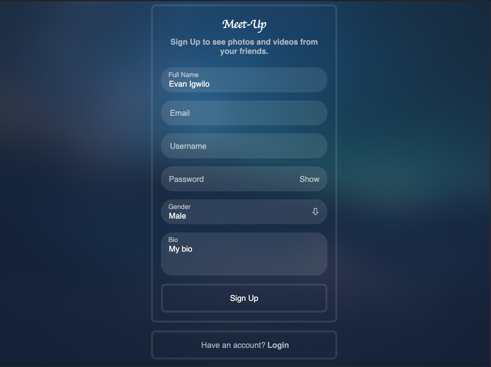
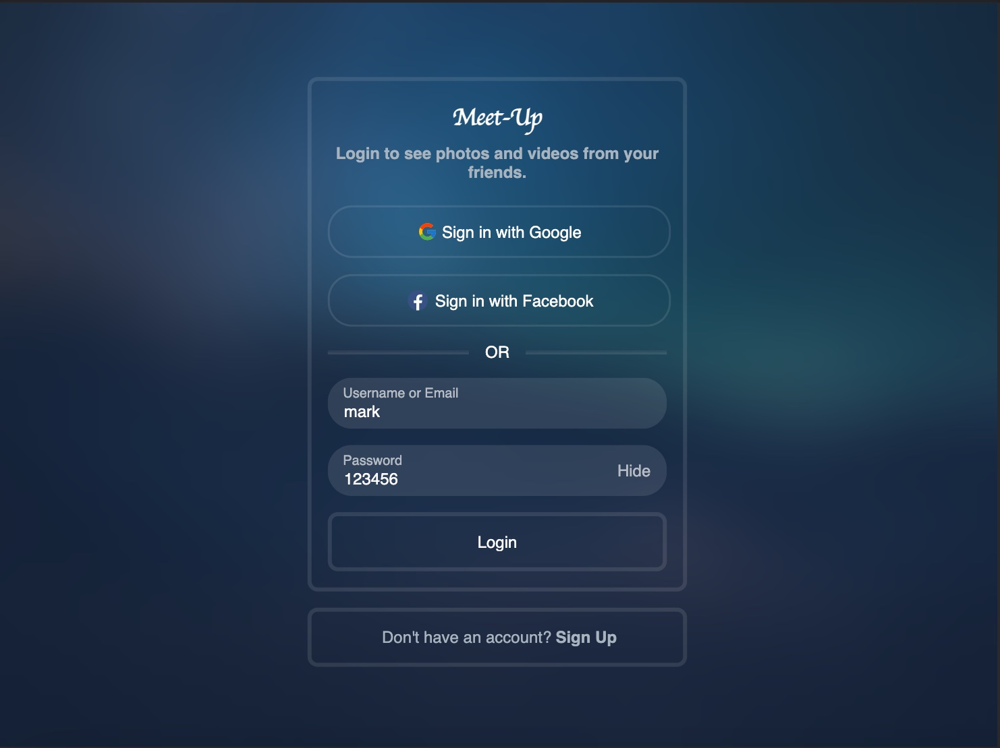

# Meet Up

[](https://github.com/evanigwilo/meet-up/actions/workflows/build-test-deploy.yml)<space><space>
[](https://www.typescriptlang.org)

**Meet Up** is an online social media and social networking service on which users post texts, images and videos known.

Registered users can create, like, comment on post, follow and unfollow users, video call users and direct message (DM), while unregistered users only have the ability to view public posts.

**This project is as an inspiration on a simple distributed application running across multiple Docker containers.** This solution uses `React.js`, `Node.js`, with `Redis` for cache/messaging, `Postgres` for relational data and `MongoDB` for non-relational data like images and videos and `Nginx` as a reverse proxy.

**Live Demo** available in the repository about section.

## Demo accounts

```javascript
username: mark;
password: 123456;

username: jane;
password: 123456;

username: tom;
password: 123456;
```

## Features

- Authentication with OAuth 2.0
  - Facebook Sign-In
  - Google Sign-In
- Search for users
- Pagination of posts, messages and notifications
- Create posts with images, videos or audios
  - Like posts
  - Comment on posts
    - Like comment
    - View all comments on a post
- Realtime Messaging with images, videos or audios
  - Online and last seen check
  - Delete messages sent
  - Total unread messages visible hint
  - React on message using animated emoji selector
- Realtime Video call
  - Offline check
- Profile Page
  - Change profile picture
  - Change bio
  - Follow / Unfollow Users
  - Toggle show / hide notifications
  - Mutual status in relation to a user
  - View posts categorized by liked, created, commented on, or with media
- Notifications Alert
  - New Followers
  - New Messages
  - Created Posts
  - Liked Posts
  - Bio update
  - Total unseen notifications visible hint
- Responsive design for mobile, tablet, and desktop
- Used [React context](https://react.dev/reference/react/useContext) to manage state

## Upcoming Features

- Automating Docker container base image updates using [Watchtower](https://containrrr.dev/watchtower)
- Notification sounds
- Group message
- Password update

## Screenshots

## 
## 
## 
## 
## 
## 
## 
## 
## 
## 
## 
## 

## Design Notes

- Redis in-memory data store for:
  - Managing user sessions
  - Database cache for faster querying
  - Managing unique ids for sending messages or uploading media referencing a post/message
- An unauthenticated user can only view posts, comments, likes and users
- An authenticated user can additionally create/like/comment on posts, manage user information, follow/unfollow users, message/video call users...
- Load balancer using Nginx
- CI/CD with GitHub Actions
- Post displays comments with threads
- Pagination
- Uploads with progress indicator
- Video call using WebRTC
- Password and OAuth 2.0 authentication strategy
- Data streaming using MongoDB GridFS to deliver partial content
- Notifications using WebSockets and GraphQL subscriptions
- Test Driven Development (TDD)
- User authentication and authorization using cookie session
- User search optimization using debouncing technique
- Responsive web design

## Architecture

### High-level architecture

This is a high-level view of how the different containers interact with each other.

<p align="center">
  
</p>

---

### Technologies used

**Communication/Messaging**:

- [WebSocket](https://en.wikipedia.org/wiki/WebSocket) communications protocol for a persistent, bi-directional, full duplex TCP connection from a user's web browser to a server.
- [Simple-peer](https://github.com/feross/simple-peer) simple library to easily transfer files over WebRTC.

**Authentication/Authorization**:

- [Passport.js](https://www.passportjs.org) for managing and authenticating users using OAuth 2.0 authentication strategy.
- [Express session middleware](https://github.com/expressjs/session) HTTP server-side framework used to create and manage a session middleware.

**Storage**:

- [PostgreSQL](https://www.postgresql.org) free and open-source relational database management system (RDBMS)
- [MongoDB](https://www.mongodb.com) open source NoSQL database management program that manages document-oriented information.
- [Redis](https://redis.io) in-memory data structure store, used as a distributed, in-memory key–value database, cache and message broker.

**CI/CD**:

- [GitHub Actions](https://docs.github.com/en/actions) continuous integration and continuous delivery (CI/CD) platform that allows you to automate your build, test, and deployment pipeline.

**Networking/Routing**:

- [Nginx](https://www.nginx.com) web server that can also be used as a reverse proxy, load balancer, mail proxy and HTTP cache

**Containers**:

- [Docker](https://www.docker.com) used to automate the deployment of applications in lightweight containers so that applications can work efficiently in different environments.

**Query Language**:

- [Apollo GraphQL](https://www.apollographql.com) open source query language that describes how a client should request information through an API.

**Forms Validation**:

- [React Hook Form](https://react-hook-form.com) library that helps you validate forms in React.js.

**JavaScript library**:

- [React.js](https://react.dev) declarative, efficient, and flexible JavaScript library for building reusable UI components.
- [Styled-components](https://www.styled-components.com) use component-level styles in your applications by the leverage mixture of JavaScript and CSS using a technique called CSS-in-JS.

### GraphQL Resolvers

| Resolvers             | Description                                              |
| --------------------- | -------------------------------------------------------- |
| auth                  | Gets user attributes for the current authenticated user. |
| register              | Registers and authenticates users.                       |
| login                 | Logs in and authenticates users.                         |
| logout                | Logs out the current authenticated user.                 |
| getUser               | Gets a user profile.                                     |
| getFollowCount        | Gets a user follow count.                                |
| getFollowStatus       | Gets a user follow status in relation to another user.   |
| getFollowing          | Gets users following a user.                             |
| getFollowers          | Gets a user followers.                                   |
| getUserPosts          | Gets a user posts.                                       |
| getUserComments       | Gets a user comments on a post.                          |
| getUserMedias         | Gets a user posts with attachment.                       |
| getUserLikes          | Gets posts the current user liked.                       |
| findUser              | Finds a user by name or handle.                          |
| followUser            | Follow a user.                                           |
| unFollowUser          | Unfollow a user.                                         |
| updateBio             | Updates a user bio.                                      |
| toggleNotification    | Toggle showing notifications.                            |
| getPost               | Gets a post.                                             |
| getPosts              | Gets paginated posts.                                    |
| createPost            | Creates a post.                                          |
| likePost              | Like a post.                                             |
| unLikePost            | Unlike a post.                                           |
| getMessages           | Gets messages between users.                             |
| getConversations      | Gets conversations between users.                        |
| sendMessage           | Sends a message to a user.                               |
| deleteMessage         | Deletes a sent message.                                  |
| addReactionMessage    | Adds a reaction to a message.                            |
| removeReactionMessage | Removes a reaction from a message.                       |
| getNotifications      | Gets user notifications.                                 |
| getMimeTypes          | Gets supported media types for file uploads.             |

### API Routes

| Routes | Description |
| ------ | ----------- |
| /image/:category <br/> /image/:category/:id <br/> /image/:category/:auth/:username | Get, Post or Delete an image by category or authentication type and username. |
| /media/:category/:id | Get, Post or Delete a media file by category.|
| /auth/facebook | Authenticate users with Facebook using the OAuth 2.0 API.|
| /auth/google | Authenticate users with Google using the OAuth 2.0 API.|

---

## Requirements

Before getting started, make sure you have the following requirements:

- [Docker](https://www.docker.com)
- [Docker Compose](https://docs.docker.com/compose/) (Supporting compose file version 3)
- A [bash](https://www.gnu.org/software/bash) compatible shell

### Run The Project

Follow these steps to get your development environment set up:

1. **Clone this repository** locally;

```bash
# Change to the desired directory
$ cd <desired-directory>

# Clone the repo
$ git clone https://github.com/evanigwilo/meet-up.git

# Change to the project directory
$ cd meet-up
```

2. Change environmental variables file name in both **backend** and **frontend** folder from `.env.example` to `.env`

3. In the backend directory, update the `.env` file values for the following variables:

```bash
# OAuth configurations
OAUTH_GOOGLE_CLIENTID=
OAUTH_GOOGLE_CLIENTSECRET=

FACEBOOK_CLIENT_ID=
FACEBOOK_CLIENT_SECRET=
```

4. At the root directory **meet-up**, run the following command:

```bash
# Create external docker volume for the mongo development database
$ docker volume create meet-up-backend_mongo-db-dev

# Create external docker volume for the postgres development database
$ docker volume create meet-up-backend_postgres-db-dev

# Build and run backend in a development container environment
$ docker-compose --env-file ./backend/.env -p meet-up-dev-stack  -f ./backend/docker-compose.yml -f ./backend/docker-compose.dev.yml up --build -d

# Build and run frontend in a development container environment
$ docker-compose --env-file ./frontend/.env -p meet-up-dev-stack -f ./frontend/docker-compose.dev.yml up --build -d
```

5. The web-app will be running at http://localhost:3000, and the api-server will be at http://localhost:4000.

## Useful commands

```bash
# Stops backend development containers and removes containers, networks and volumes
$ docker-compose --env-file ./backend/.env -p meet-up-dev-stack  -f ./backend/docker-compose.yml -f ./backend/docker-compose.dev.yml down -v --remove-orphans

# Stops frontend development containers and removes containers, networks and volumes
$ docker-compose --env-file ./frontend/.env -p meet-up-dev-stack -f ./frontend/docker-compose.dev.yml down -v --remove-orphans

# Create external docker volume for the mongo production database
$ docker volume create meet-up-backend_mongo-db-prod

# Create external docker volume for the postgres production database
$ docker volume create meet-up-backend_postgres-db-prod

# Show production compose configurations
$ docker-compose --env-file ./backend/.env -p meet-up-prod-stack -f ./backend/docker-compose.yml -f ./backend/docker-compose.prod.yml -f frontend/docker-compose.prod.yml config

# Build and run in a production container environment
$ docker-compose --env-file ./backend/.env -p meet-up-prod-stack -f ./backend/docker-compose.yml -f ./backend/docker-compose.prod.yml -f frontend/docker-compose.prod.yml up --build -d

# Stops production containers and removes containers, networks and volumes
$ docker-compose --env-file ./backend/.env -p meet-up-prod-stack -f ./backend/docker-compose.yml -f ./backend/docker-compose.prod.yml -f frontend/docker-compose.prod.yml down -v --remove-orphans

# Build and run backend tests in a container environment
$ docker-compose --env-file ./backend/.env -p meet-up-test-stack -f ./backend/docker-compose.yml -f ./backend/docker-compose.dev.yml -f ./backend/docker-compose.test.yml up --build -d

# Stops backend tests containers and removes containers, networks and volumes
$ docker-compose --env-file ./backend/.env -p meet-up-test-stack -f ./backend/docker-compose.yml -f ./backend/docker-compose.dev.yml -f ./backend/docker-compose.test.yml down -v --remove-orphans

# Build and run frontend tests in a container environment
$ docker-compose --env-file ./frontend/.env -p meet-up-test-stack -f ./frontend/docker-compose.dev.yml -f ./frontend/docker-compose.test.yml up --build -d

# Stops frontend tests containers and removes containers, networks and volumes
$ docker-compose --env-file ./frontend/.env -p meet-up-test-stack -f ./frontend/docker-compose.dev.yml -f ./frontend/docker-compose.test.yml down -v --remove-orphans

# Build and run a backend test (profile.test) in a container environment
$ cd backend
$ sh scripts/compose-test-up.sh profile.test
```

## References

> [Diagrams.net](https://www.diagrams.net)

> [Youtube Redesign Concept](https://dribbble.com/shots/12125648-Youtube-Redesign-Concept-Prototype)

> [Social Media Front-End Development by Mido Jelly](https://www.behance.net/gallery/148168731/Social-Media-Front-End-Development)

> [Twitter Homepage Concept by Yeremias NJ](https://dribbble.com/shots/17000563-Twitter-Homepage-Concept)

> [Google OAuth using TypeScript, Express.js, Passport.js & MongoDB](https://samippoudel.hashnode.dev/google-oauth-using-typescript-expressjs-passportjs-and-mongodb)

> [Add Facebook Login to your Node.js App with Passport.js](https://www.twilio.com/blog/facebook-oauth-login-node-js-app-passport-js)

> [Using mkcert in Node.js](https://dev.to/tingwei628/using-mkcert-in-node-js-ijm)

> [Achieving High Performance with PostgreSQL and Redis](https://medium.com/wultra-blog/achieving-high-performance-with-postgresql-and-redis-deddb7012b16)

> [How To Solve the Data Consistency Issues Between Redis And MySQL](https://betterprogramming.pub/how-to-solve-the-data-consistency-issues-between-redis-and-mysql-702f9ffa2452)

> [Session Management in Nodejs Using Redis as Session Store](https://medium.com/swlh/session-management-in-nodejs-using-redis-as-session-store-64186112aa9)

> [Build a video streaming server with Node.js](https://blog.logrocket.com/build-video-streaming-server-node/)

> [A React input with an option to pick emojis](https://github.com/cesarwbr/react-input-emoji)

> [GraphQL Subscriptions with Redis PubSub](https://djaytechdiary.com/graphql-subscriptions-with-redis-pubsub)

> [GraphQL Subscriptions with Redis PubSub](https://github.com/heineiuo/isomorphic-ws)

> [Docker Healthcheck for your Node.js App](https://anthonymineo.com/docker-healthcheck-for-your-node-js-app)

> [Dockerize a NodeJS , Express, Redis with Nginx Proxy using Docker Compose](https://dev.to/docker/dockerizing-a-nodejs-express-redis-app-with-nginx-proxy-using-docker-compose-17ge)

> [Dockerize a React Nodejs App and Deploy in AWS EC2 -- The Startup Way Part-1](https://kanlanc.com/dockerizing-react-node-app-deploying-to-ec2)

> [Dockerize a React Nodejs App and Deploy in AWS EC2 -- The Startup Way Part-2](https://kanlanc.com/dockerize-a-react-nodejs-app-and-deploy-in-aws-ec2-the-startup-way-part-1)

> [Extends supertest to test a GraphQL endpoint](https://github.com/alexstrat/supertest-graphql)

> [Graphql subscriptions test repository](https://github.com/apollographql/graphql-subscriptions/blob/master/src/test)

> [NGINX as a WebSocket Proxy](https://www.nginx.com/blog/websocket-nginx)

> [Dockerize a React app](https://jsramblings.com/dockerizing-a-react-app)

> [Cache management with GitHub Actions](https://docs.docker.com/build/ci/github-actions/cache)

> [Configure HTTPS on AWS EC2 without a Custom Domain](https://bansalanuj.com/https-aws-ec2-without-custom-domain)
